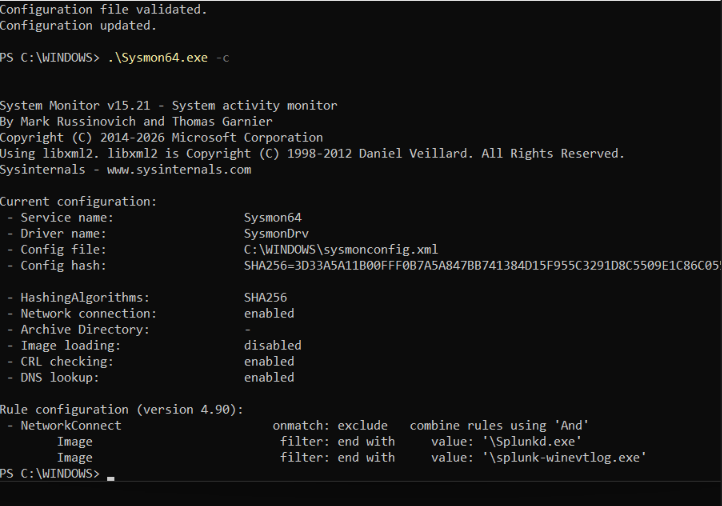

# Detecting LOLBin Network Connections with Sysmon Event ID 3 and Splunk

*Home lab detection engineering report, October 2026*

## 1. Objective

Build and test a detection that flags signed Windows binaries commonly abused by attackers (certutil, mshta, regsvr32, bitsadmin, wscript, cscript) when they make outbound network connections. These tools rarely need the network in normal use, so a connection from one deserves review.

| Field | Value |
|---|---|
| Alert name | Sysmon - LOLBin Network Connection |
| Data source | Sysmon Event ID 3 (Network Connection) |
| Platform | Splunk Enterprise |
| Severity | Medium |
| Schedule | Every 5 minutes (cron `*/5 * * * *`), search window last 5 minutes |
| Trigger | Number of results greater than 0, once |
| MITRE ATT&CK | T1218 Signed Binary Proxy Execution, T1105 Ingress Tool Transfer |

## 2. Lab architecture

- **Endpoint:** Windows 11 VM running Sysmon and the Splunk Universal Forwarder
- **SIEM:** Splunk Enterprise on an Ubuntu server, receiving on port 9997
- **Index:** `sysmon`
- **Parsing:** Splunk Add-on for Sysmon, which extracts `EventCode`, `Image`, `DestinationIp` and related fields from the raw XML

```
Windows 11 VM (Sysmon -> Universal Forwarder) --9997--> Splunk Enterprise (Ubuntu)
```

## 3. Data collection

### 3.1 Sysmon configuration

Sysmon logs every network connection except those made by Splunk's own processes, which would otherwise fill the logs with the monitoring tool watching itself.

```xml
<Sysmon schemaversion="4.90">
  <EventFiltering>
    <NetworkConnect onmatch="exclude">
      <Image condition="end with">\Splunkd.exe</Image>
      <Image condition="end with">\splunk-winevtlog.exe</Image>
    </NetworkConnect>
  </EventFiltering>
</Sysmon>
```



*Figure 1. Active Sysmon configuration. Network connection logging is enabled, and the NetworkConnect rule excludes only the two Splunk binaries.*

### 3.2 Forwarder input

`inputs.conf` on the VM:

```
[WinEventLog://Microsoft-Windows-Sysmon/Operational]
disabled = 0
renderXml = true
index = sysmon
source = XmlWinEventLog:Microsoft-Windows-Sysmon/Operational
```

### 3.3 Issue encountered: forwarder could not read the Sysmon log

After the input was configured, no Sysmon events appeared in Splunk. The forwarder log (`splunkd.log`) showed that it could not subscribe to the Sysmon channel, with `errorCode=5` (access denied). The forwarder runs as the virtual account `NT SERVICE\SplunkForwarder`, which has no read access to the Sysmon channel by default.


*Figure 2. Service account (`NT SERVICE\SplunkForwarder`) and the splunkd.log error: unable to subscribe to the Sysmon/Operational channel, errorCode=5.*

**Fix:** add the service account to the Event Log Readers group and restart the forwarder. Events began arriving afterwards.

```
net localgroup "Event Log Readers" "NT SERVICE\SplunkForwarder" /add
Restart-Service SplunkForwarder
```

## 4. Data verification

Raw events arrived as XML, so the Splunk Add-on for Sysmon was installed on the Ubuntu server. Afterwards the fields were extracted and searchable, for example `EventCode=3`.


*Figure 3. Event ID 3 events from the `sysmon` index over the last 24 hours, with Image, User, Protocol, Initiated and SourceIp extracted.*

## 5. Baseline

Before writing the rule, I listed which programs make outbound connections to learn what is normal on this machine:

```spl
index=sysmon EventCode=3 Initiated=true
| stats count dc(DestinationIp) as unique_dests by Image
| sort - count
```


*Figure 4. Baseline of outbound connections by process (25 distinct processes). The top entries are normal Windows and Microsoft background traffic: svchost.exe, msedge.exe, msedgewebview2.exe, MpDefenderCoreService.exe and OneDrive.*

One detail from the baseline: `svchost.exe` appears under both `System32` and `system32`, which Splunk treats as different values. The detection therefore lowercases the `Image` field before matching.

## 6. Detection logic

```spl
index=sysmon EventCode=3 Initiated=true
| eval img=lower(Image)
| where like(img,"%\\certutil.exe") OR like(img,"%\\mshta.exe")
  OR like(img,"%\\regsvr32.exe") OR like(img,"%\\bitsadmin.exe")
  OR like(img,"%\\wscript.exe") OR like(img,"%\\cscript.exe")
| table _time host User Image DestinationIp DestinationPort
```

- `Initiated=true` limits results to connections started by this host.
- `lower(Image)` removes path-case differences.
- **Result against the baseline:** 0 events over 24 hours, so the rule starts with no false positives.


*Figure 5. The final detection search over the last 24 hours returns 0 events against the normal baseline.*

## 7. Alert configuration

| Setting | Value |
|---|---|
| Alert type | Scheduled, run on cron schedule |
| Cron expression | `*/5 * * * *` |
| Time range | Last 5 minutes (matches the schedule, so one event cannot trigger repeatedly) |
| Trigger condition | Number of results greater than 0, once |
| Trigger action | Add to Triggered Alerts |
| Severity | Medium: suspicious behavior needing triage, not proof of compromise |

## 8. Validation

Direct LOLBin tests did not all produce a connection in this lab, so the end-to-end pipeline was validated with a temporary stand-in, then the stand-in was removed.

| Test | Result |
|---|---|
| LOLBin search against the 24h baseline | 0 events (expected) |
| `certutil -urlcache` download | Blocked by Windows ("Access is denied"). No connection was made, so there was nothing for Sysmon to log. Prevention acted before detection. |
| `bitsadmin /transfer` | No match. BITS hands the job to a service in `svchost.exe`, so the connection was logged under `svchost.exe`, not `bitsadmin.exe`. |
| `cscript` running a script that requests example.com | Process start and exit logged (Event IDs 1 and 5), but no DNS or connection event, so the rule had nothing to match. |
| `powershell.exe` added as a temporary stand-in | Matched. The scheduled alert fired and appeared in Triggered Alerts. |


*Figure 6. Pipeline test. `powershell.exe` was temporarily added to the rule; the search matched my test request to example.com (port 443). This is not the final rule.*


*Figure 7. Triggered Alerts: "Sysmon - LOLBin Network Connection" fired at 2026-10-03 11:20:01 UTC with Medium severity.*

The stand-in was then removed, because PowerShell makes legitimate connections constantly and would flood the alert. The saved search was checked afterwards:


*Figure 8. Final saved search: the query no longer contains powershell.exe, and `disabled = 0` (the alert is active).*

**Open item:** a direct LOLBin connection triggering the final rule was not achieved in this lab. The detection logic and alerting path are proven, but a live test with a tool that makes its own connection is still outstanding.

## 9. Limitations and tuning

- **BITS coverage gap:** bitsadmin activity appears as `svchost.exe` connections, so this rule does not catch it. That needs BITS client event logs.
- **Legitimate use:** wscript, cscript and regsvr32 can make legitimate connections in some environments. An allowlist on `DestinationHostname` or `User` may be needed.
- **Context:** join Event ID 1 on `ProcessGuid` to see the parent process and command line. A LOLBin spawned by Word or Excel would justify High severity.
- **Scheduler load:** on this small lab server some scheduled runs were skipped. The next run still caught the event, but a 10-minute schedule and window is an option if skips continue.

## 10. Next steps

- Add a beaconing detection for regular-interval connections (T1071)
- Join Event ID 1 for parent process and command line
- Add Sysmon Event ID 22 (DNS) for domain context
- Run a live LOLBin test to close the open validation item
